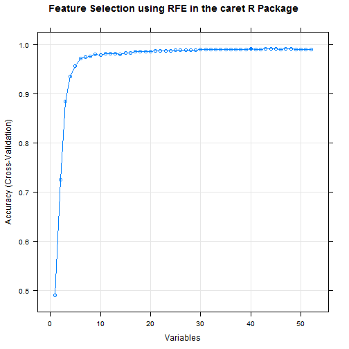

## Human Activity Recognition: Assessment of Activity Quality by Machine Learning Techniques
#### James C Weaver
#### Monday, December 15, 2014

## Introduction
Traditionally, research on human activity recognition (HAR) has focused on identifying and predicting which activity was performed at some specific time.  In their conference paper at the 2013 Augmented Human International Conference, Velloso and Bulling et al. extended this concept to the identification of how well an activity was performed by the wearer of the activity recognition device (1).  To do this, they asked six male participants with little weight lifting experience and between the ages of 20 and 28 to perform 10 repetitions of the activity "Unilateral Dumbbell Biceps Curl" in five different fashions, Classes A through E.  Class A corresponds to the correct specification of the activity; classes B through E correspond to common mistakes made by people performing the exercise.  Participants wore sensors during the exercise which captured three-axes acceleration, gyroscope and magnetometer data.  Each participant had four such sensors mounted in the user's glove, armband, lumbar belt and the dumbbell itself.  From these data, 96 feature sets were generated for each sensor.  In the dataset analyzed in this course project, 38 feature variables were made available for each sensor.

In their conference paper, Velloso and Bulling used machine learning techniques to detect mistakes by classification.  They used a Random Forest approach "because of the characteristic noise in the sensor data," achieving an overall recognition performance of 98.03%.  In this course project, we also analyze a subset of the Velloso and Bulling data with a random forest model, and assess prediction accuracy with their overall accuracy recognition performance as our benchmark measure.

## Model Building
### Data acquisition and cleaning
Training and testing data were down loaded from the following websites and stored in the working directory for R:
https://d396qusza40orc.cloudfront.net/predmachlearn/pml-training.csv,

https://d396qusza40orc.cloudfront.net/predmachlearn/pml-testing.csv


```r
# rm(list=ls())
# ls()
# getwd()
# setwd("./DataScience-JohnsHopkins/Data3")

# setInternet2(use=TRUE)
# Project url's as sources of the data
# https://d396qusza40orc.cloudfront.net/predmachlearn/pml-training.csv
# fileid1<-"https://d396qusza40orc.cloudfront.net/predmachlearn/pml-training.csv"
# download.file(fileid1, destfile="pml-training.csv")

# https://d396qusza40orc.cloudfront.net/predmachlearn/pml-testing.csv
# fileid2<-"https://d396qusza40orc.cloudfront.net/predmachlearn/pml-testing.csv"
# download.file(fileid2, destfile="pml-testing.csv")
```
#### testingData
The testing data set was loaded into R and was found to consist of 20 cases and 160 variables.  The first 7 variables dealing with the user and data acquisition process are not useful in the data analysis and were removed from the dataset.  Many of the 152 feature variables contained missing or NA data.  If these missing data were a small percentage of the feature variable, they could be replaced by imputing values from the remaining data.  Thus, we choose to remove those feature variables from the dataset which had more than 75% missing values.  This resulted in retaining 52 feature variables in the dataset, none of which contained any missing values.  Therefore, data imputation was not necessary.

```r
# Load the testing data set into R, remove columns having more than 75% missing values, remove first 7 columns
testingData<-read.csv("pml-testing.csv", na.strings = c("NA", ""), check.names=TRUE)
dim(testingData)
```

```
## [1]  20 160
```

```r
naCols<- sapply(testingData, function(x) {sum(is.na(x)) / nrow(testingData) >0.75})
testingData<-subset(testingData, select= !naCols)
dim(testingData)
```

```
## [1] 20 60
```

```r
testingData<- testingData[,-c(1:7)]
dim(testingData)
```

```
## [1] 20 53
```
#### trainingData
The training data were loaded into R and found to consist of 19622 cases and 160 variables.  The same criteria used for the testing data was applied to the training data, and the same 52 feature variables were retained.  No data imputation was necessary.

```r
# Load the training data set into R, remove columns having more than 75% missing values, remove first 7 columns
trainingData<-read.csv("pml-training.csv", na.strings = c("NA", ""), check.names=TRUE)
dim(trainingData)
```

```
## [1] 19622   160
```

```r
naCols<- sapply(trainingData, function(x) {sum(is.na(x)) / nrow(trainingData) >0.75})
trainingData<-subset(trainingData, select= !naCols)
dim(trainingData)
```

```
## [1] 19622    60
```

```r
trainingData<- trainingData[,-c(1:7)]
dim(trainingData)
```

```
## [1] 19622    53
```
### Data Partitioning
The testing data were used to evaluate out of sample performance of our prediction model by predicting the Class for each of the 20 cases.  The training data was randomly partitioned into two sets, a training set consisting of 60% of the cases and a validation set consisting of 40% of the cases.  The training set was used to build the prediction model.  The validation set was used to evaluate out of sample performance of the model.


```r
# Partition trainingData into a training set and a validation set
library(caret)
```

```
## Warning: package 'caret' was built under R version 3.1.2
```

```
## Loading required package: lattice
## Loading required package: ggplot2
```

```r
set.seed= 122014
inTrain <- createDataPartition(y = trainingData$classe, p = 0.6, list = FALSE)
training<- trainingData[inTrain,]
validation<- trainingData[-inTrain,]
dim(training)
```

```
## [1] 11776    53
```

```r
dim(validation)
```

```
## [1] 7846   53
```
### Random Forest Model
A random forest prediction model was built using the caret package in R.  The model was trained using 5 fold cross validation so that an expected sample error rate could be determined and then compared with the performance of the model on the validation set.  Since the time required to train the random forest model is quit long (about 1 hour), the resulting model, rfModelcv, was saved to the working directory for subsequent model evaluation and predictions.  Note also that the importance attribute was set to TRUE in the train statement so that feature rank could be assessed.


```r
# randomForest model with 5 fold cross validation using caret
library(randomForest)
```

```
## Warning: package 'randomForest' was built under R version 3.1.2
```

```
## randomForest 4.6-10
## Type rfNews() to see new features/changes/bug fixes.
```

```r
mycontrol <- trainControl(method = "cv", number = 5)
# rfModelcv<- train(classe ~., data=training, method = "rf", trControl = mycontrol, importance=TRUE)
# Save model object to file
# save(rfModelcv, file="rfModelcv.RData")
load(file="rfModelcv.RData")
```
## Model Evaluation
### Model Output
The random forest model with 5 fold cross validation resulted in a final model with an overall accuracy of 0.9887 at an mtry value of 27.  The out of bag (OOB) estimate of error rate was 0.82%. This is the error rate to be expected in an out of sample evaluation.


```r
print(rfModelcv)
```

```
## Random Forest 
## 
## 11776 samples
##    52 predictor
##     5 classes: 'A', 'B', 'C', 'D', 'E' 
## 
## No pre-processing
## Resampling: Cross-Validated (5 fold) 
## 
## Summary of sample sizes: 9420, 9421, 9421, 9420, 9422 
## 
## Resampling results across tuning parameters:
## 
##   mtry  Accuracy   Kappa      Accuracy SD   Kappa SD   
##    2    0.9871776  0.9837745  0.0013194269  0.001670208
##   27    0.9887057  0.9857112  0.0014599807  0.001846958
##   52    0.9831863  0.9787278  0.0009258167  0.001171205
## 
## Accuracy was used to select the optimal model using  the largest value.
## The final value used for the model was mtry = 27.
```

```r
print(rfModelcv$finalModel)
```

```
## 
## Call:
##  randomForest(x = x, y = y, mtry = param$mtry, importance = TRUE) 
##                Type of random forest: classification
##                      Number of trees: 500
## No. of variables tried at each split: 27
## 
##         OOB estimate of  error rate: 0.82%
## Confusion matrix:
##      A    B    C    D    E class.error
## A 3344    2    2    0    0 0.001194743
## B   24 2246    9    0    0 0.014480035
## C    0   15 2034    5    0 0.009737098
## D    0    1   27 1901    1 0.015025907
## E    0    1    3    7 2154 0.005080831
```
### Model Evaluation on the Validation Data Partition
When evaluated on the validation data partition set, the final model produced and overall accuracy of 0.9963 (95% CI of 0.9947, 0.9975).  This corresponds to an out of sample error rate of 0.37% which agrees well with the OOB estimate of 0.82% from cross validation and the 1.97% error rate reported by Velloso and Bulling et al. on the dataset with the larger feature set.


```r
pred.rfModelcv<- predict(rfModelcv, newdata=validation)
confusionMatrix(pred.rfModelcv, validation$classe)
```

```
## Confusion Matrix and Statistics
## 
##           Reference
## Prediction    A    B    C    D    E
##          A 2230   10    0    0    0
##          B    1 1503   18    0    0
##          C    0    5 1347   18    1
##          D    0    0    3 1266    7
##          E    1    0    0    2 1434
## 
## Overall Statistics
##                                           
##                Accuracy : 0.9916          
##                  95% CI : (0.9893, 0.9935)
##     No Information Rate : 0.2845          
##     P-Value [Acc > NIR] : < 2.2e-16       
##                                           
##                   Kappa : 0.9894          
##  Mcnemar's Test P-Value : NA              
## 
## Statistics by Class:
## 
##                      Class: A Class: B Class: C Class: D Class: E
## Sensitivity            0.9991   0.9901   0.9846   0.9844   0.9945
## Specificity            0.9982   0.9970   0.9963   0.9985   0.9995
## Pos Pred Value         0.9955   0.9875   0.9825   0.9922   0.9979
## Neg Pred Value         0.9996   0.9976   0.9968   0.9970   0.9988
## Prevalence             0.2845   0.1935   0.1744   0.1639   0.1838
## Detection Rate         0.2842   0.1916   0.1717   0.1614   0.1828
## Detection Prevalence   0.2855   0.1940   0.1747   0.1626   0.1832
## Balanced Accuracy      0.9987   0.9936   0.9905   0.9915   0.9970
```
### Class predictions for the testing data set, "testingData"
The final random forest model was then applied to the testing dataset to predict the class for each of the 20 cases contained in that set.  The model achieved 100% accuracy on this set as indicated by the Coursera submission.


```r
# Class predictions for the testing data set, testingData
test.prediction<- predict(rfModelcv, newdata=testingData)
table(answers<- as.character(test.prediction))
```

```
## 
## A B C D E 
## 7 8 1 1 3
```
### Feature Rank by Importance
Feature rank by importance with respect to model accuracy was estimated with the varImp() function.  The 20 most important variables (out of the 52 features) are given below.


```r
rfModelcvImp<- varImp(rfModelcv, scale=FALSE)
rfModelcvImp
```

```
## rf variable importance
## 
##   variables are sorted by maximum importance across the classes
##   only 20 most important variables shown (out of 52)
## 
##                       A     B     C     D     E
## pitch_belt        24.91 75.35 50.42 38.80 36.39
## roll_belt         59.52 65.35 63.75 58.87 74.53
## pitch_forearm     50.93 59.53 71.71 47.96 50.76
## magnet_dumbbell_y 50.68 51.04 61.92 46.83 44.88
## magnet_dumbbell_z 57.26 44.67 57.46 42.98 40.22
## yaw_belt          55.92 49.10 49.63 55.68 38.79
## accel_forearm_x   21.66 32.09 32.43 39.85 32.65
## roll_forearm      38.26 33.14 39.73 27.89 30.26
## gyros_dumbbell_y  33.87 26.64 35.15 28.01 22.47
## gyros_belt_z      20.81 25.25 27.69 22.27 33.58
## yaw_arm           32.77 26.59 25.95 29.60 20.68
## accel_dumbbell_z  23.71 27.72 23.83 27.64 31.40
## accel_dumbbell_y  27.77 25.97 31.34 24.81 27.64
## magnet_belt_z     21.54 28.89 22.22 26.62 25.78
## roll_dumbbell     21.47 28.59 23.03 25.73 27.36
## magnet_belt_y     16.50 27.09 25.51 19.24 22.28
## magnet_belt_x     15.36 26.78 24.11 17.97 24.13
## magnet_forearm_z  25.97 25.82 22.79 23.91 26.53
## yaw_dumbbell      14.17 26.08 20.40 19.46 21.40
## gyros_arm_y       25.00 25.95 20.50 23.56 18.60
```
### Feature Selection using Recursive Feature Elimination (RFE Method in caret)
Using the recursive feature elimination function in caret, all possible subsets of the predictor variables are explored in order to identify that subset of features responsible for most determining model accuracy.  As seen below, five features are responsible for 95.6% of the prediction accuracy:  roll_belt, yaw_belt, magnet_dumbbell_z, pitch_belt, magnet_dumbbell_y.  Further note that this result is consistent with the importance ranking described above.  The five features identified by RFE are in the set of the six most important features identified by the varImp() function.


```r
set.seed= 122014
control<- rfeControl(functions=rfFuncs, method="cv", number=5)
#results<- rfe(training[,1:52], training[,53], sizes=c(1:52), rfeControl=control)
# Save rfe output to file
# save(results, file="results.RData")
load(file="results.RData")
print(results)
```

```
## 
## Recursive feature selection
## 
## Outer resampling method: Cross-Validated (5 fold) 
## 
## Resampling performance over subset size:
## 
##  Variables Accuracy  Kappa AccuracySD   KappaSD Selected
##          1   0.4907 0.3425  0.0089657 0.0131633         
##          2   0.7250 0.6510  0.0149516 0.0192664         
##          3   0.8853 0.8548  0.0070895 0.0090004         
##          4   0.9355 0.9184  0.0044895 0.0056492         
##          5   0.9564 0.9448  0.0063860 0.0080756         
##          6   0.9727 0.9654  0.0039169 0.0049473         
##          7   0.9749 0.9682  0.0050723 0.0064124         
##          8   0.9768 0.9707  0.0063140 0.0079850         
##          9   0.9804 0.9752  0.0029159 0.0036809         
##         10   0.9793 0.9738  0.0038143 0.0048138         
##         11   0.9821 0.9773  0.0028532 0.0036053         
##         12   0.9823 0.9777  0.0031590 0.0039912         
##         13   0.9821 0.9773  0.0031840 0.0040262         
##         14   0.9812 0.9763  0.0035962 0.0045457         
##         15   0.9835 0.9792  0.0025383 0.0032098         
##         16   0.9842 0.9800  0.0018138 0.0022952         
##         17   0.9866 0.9830  0.0012228 0.0015482         
##         18   0.9868 0.9832  0.0025742 0.0032569         
##         19   0.9870 0.9836  0.0020062 0.0025368         
##         20   0.9870 0.9836  0.0017925 0.0022679         
##         21   0.9879 0.9846  0.0013652 0.0017262         
##         22   0.9875 0.9842  0.0012258 0.0015510         
##         23   0.9879 0.9847  0.0017650 0.0022331         
##         24   0.9880 0.9849  0.0016837 0.0021287         
##         25   0.9890 0.9860  0.0016713 0.0021153         
##         26   0.9896 0.9868  0.0012227 0.0015469         
##         27   0.9891 0.9862  0.0016048 0.0020306         
##         28   0.9892 0.9864  0.0019355 0.0024480         
##         29   0.9894 0.9866  0.0009505 0.0012006         
##         30   0.9903 0.9878  0.0006970 0.0008809         
##         31   0.9905 0.9880  0.0019127 0.0024189         
##         32   0.9901 0.9875  0.0018846 0.0023830         
##         33   0.9907 0.9882  0.0015305 0.0019353         
##         34   0.9907 0.9883  0.0020657 0.0026131         
##         35   0.9909 0.9885  0.0018641 0.0023582         
##         36   0.9909 0.9885  0.0013295 0.0016815         
##         37   0.9912 0.9888  0.0017607 0.0022266         
##         38   0.9909 0.9885  0.0016063 0.0020305         
##         39   0.9911 0.9887  0.0013081 0.0016544         
##         40   0.9915 0.9893  0.0013067 0.0016527        *
##         41   0.9912 0.9888  0.0011375 0.0014393         
##         42   0.9907 0.9883  0.0010977 0.0013887         
##         43   0.9913 0.9890  0.0012579 0.0015911         
##         44   0.9913 0.9890  0.0009749 0.0012337         
##         45   0.9914 0.9891  0.0010551 0.0013359         
##         46   0.9910 0.9886  0.0015986 0.0020235         
##         47   0.9914 0.9891  0.0014199 0.0017961         
##         48   0.9913 0.9890  0.0013939 0.0017633         
##         49   0.9910 0.9886  0.0015418 0.0019510         
##         50   0.9912 0.9888  0.0011773 0.0014892         
##         51   0.9907 0.9883  0.0015120 0.0019129         
##         52   0.9911 0.9887  0.0009484 0.0011997         
## 
## The top 5 variables (out of 40):
##    roll_belt, yaw_belt, magnet_dumbbell_z, pitch_belt, magnet_dumbbell_y
```

```r
predictors(results)
```

```
##  [1] "roll_belt"            "yaw_belt"             "magnet_dumbbell_z"   
##  [4] "pitch_belt"           "magnet_dumbbell_y"    "pitch_forearm"       
##  [7] "roll_forearm"         "roll_dumbbell"        "accel_dumbbell_y"    
## [10] "magnet_dumbbell_x"    "magnet_forearm_z"     "accel_dumbbell_z"    
## [13] "magnet_belt_z"        "roll_arm"             "magnet_belt_y"       
## [16] "gyros_belt_z"         "accel_forearm_x"      "yaw_arm"             
## [19] "yaw_dumbbell"         "magnet_belt_x"        "gyros_dumbbell_y"    
## [22] "total_accel_dumbbell" "accel_belt_z"         "magnet_forearm_y"    
## [25] "accel_forearm_z"      "gyros_arm_y"          "magnet_arm_z"        
## [28] "gyros_forearm_y"      "accel_dumbbell_x"     "accel_forearm_y"     
## [31] "gyros_dumbbell_x"     "yaw_forearm"          "gyros_arm_x"         
## [34] "pitch_arm"            "magnet_forearm_x"     "magnet_arm_x"        
## [37] "total_accel_forearm"  "gyros_dumbbell_z"     "accel_arm_y"         
## [40] "accel_arm_x"
```
In their work, Velloso and Bulling identified 17 features as the most important for prediction:  7 in the belt, 3 in the arm, 3 in the glove and 4 in the dumbbell (1).  In our work, features in only the belt and dumbbell were responsible for over 95% of the prediction accuracy.  Figure 1 shows a plot of cumulative accuracy as a function of the ranked predictors from the RFE analysis.  Note the break in the curve after the 6th predictor.  The six most important predictors account for 97.27% of the final model accuracy.

#### Figure 1:  Cumulative Accuracy as a function of the Ranked Predictors from the RFE Analysis


```r
plot(results, type=c("g","o"), main="Feature Selection using RFE in the caret R Package")
```

 

### Analysis of Correlated Features
It is also interesting to compare this set of features from the RFE analysis with the set of highly correlated variables in the training set.  The first five predictors identified by the RFE analysis are fully contained within the set of highly correlated variables in the training partition of the trainingData set.  Thus, it would have been ill-advised to have removed the highly correlated variables from the training set in advance of building the random forest model.

```r
correlationMatrix<- cor(training[,1:52])
highlyCorrelated<- findCorrelation(correlationMatrix, cutoff=0.5)
variables<- names(training)
variables[highlyCorrelated]
```

```
##  [1] "accel_belt_z"         "roll_belt"            "accel_arm_y"         
##  [4] "accel_belt_y"         "yaw_belt"             "total_accel_belt"    
##  [7] "accel_dumbbell_z"     "accel_belt_x"         "pitch_belt"          
## [10] "magnet_belt_x"        "yaw_dumbbell"         "magnet_dumbbell_x"   
## [13] "accel_dumbbell_y"     "magnet_dumbbell_y"    "total_accel_dumbbell"
## [16] "accel_forearm_x"      "accel_dumbbell_x"     "accel_arm_x"         
## [19] "magnet_dumbbell_z"    "magnet_forearm_z"     "accel_arm_z"         
## [22] "magnet_arm_y"         "magnet_belt_y"        "accel_forearm_y"     
## [25] "magnet_arm_x"         "magnet_arm_z"         "gyros_dumbbell_x"    
## [28] "gyros_arm_y"          "gyros_forearm_z"
```
## Conclusions
A random forest machine learning algorithmic model was built from the human activity recognition dataset of Velloso and Bulling et al. and applied to predict the class of activity in the Unilateral Dumbbell Biceps Curl exercise.  The model has an out of sample prediction accuracy of 99.63% (0.9947, 0.9975) on a truncated feature set of the Velloso-Bulling data, a value which compares well with their reported accuracy using the random forest algorithm of 98.03%.  A six member subset of the features responsible for over 97% of the model accuracy was also identified using Recursive Feature Elimination.  This subset consisted of features from sensors located primarily in the belt and dumbbell.

## Reference
1)  E. Velloso, A. Bulling, H. Gellersen, W. Ugulino and H. Fuks, Qualitative Activity Recognition of Weight Lifting Exercises, Augmented Human International Conference (AH), March 2013. Stuttgart, Germany: ACMSIGCHI, 2013.
